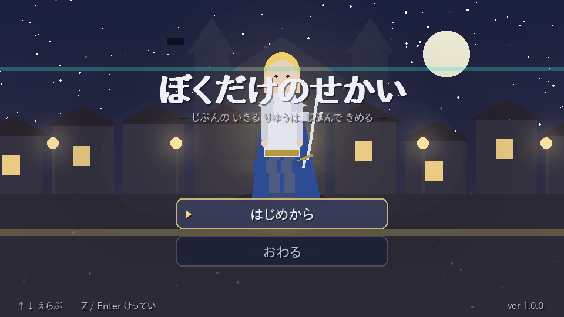
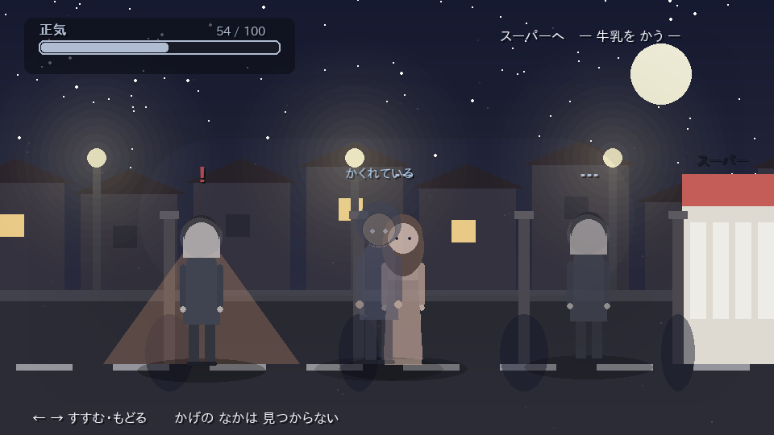
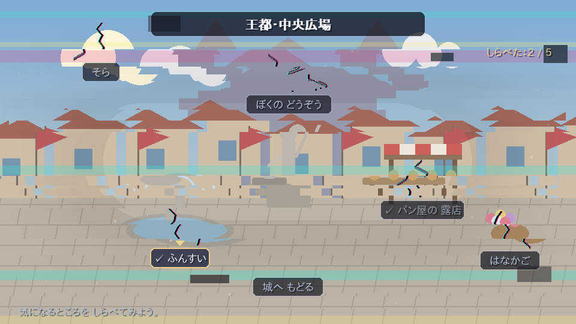
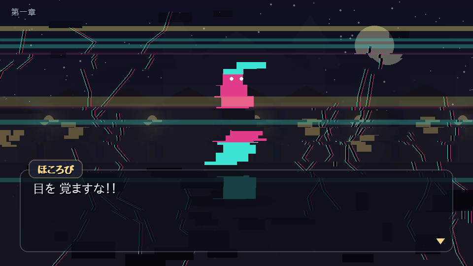
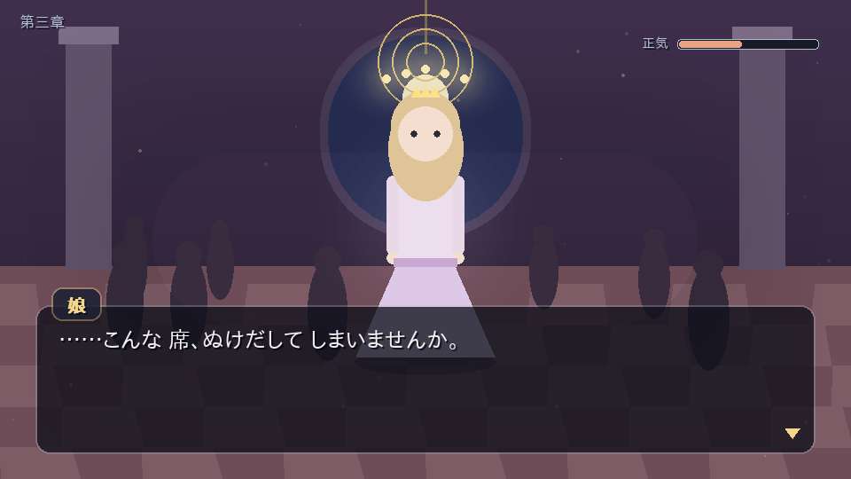
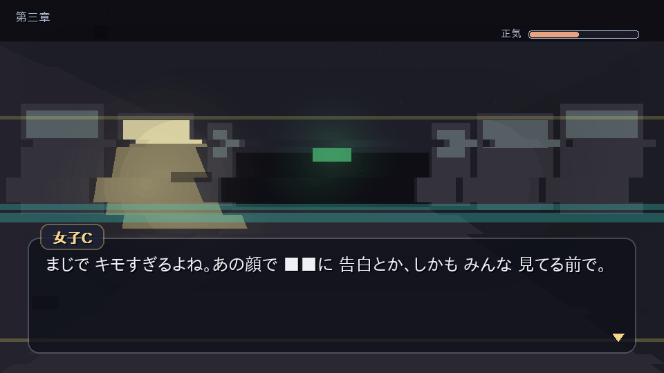
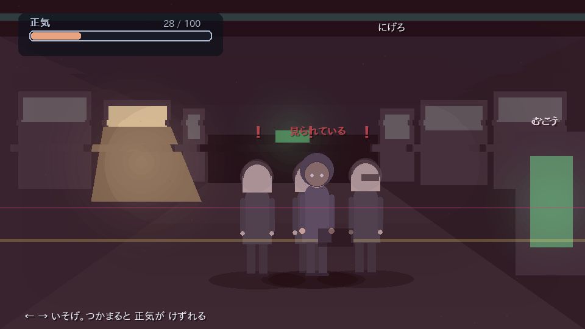
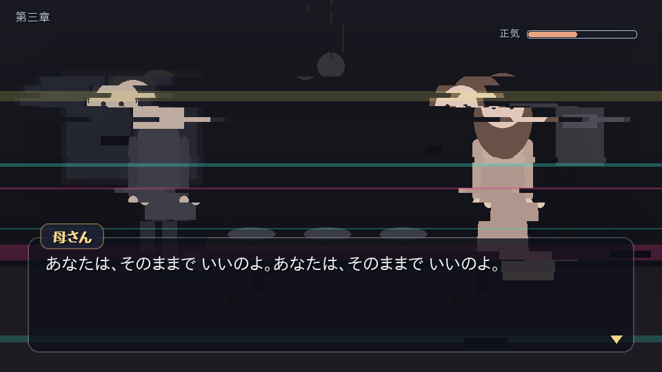

# ぼくだけのせかい

> テーマ：**自分の生きる理由は自分で決める**

Python + pygame で作った、ストーリー重視の RPG（ADV 寄り）です。
画像・音声の外部素材は一切使わず、背景も立ち絵も演出もすべてコードで描いています。



---

## あらすじ

魔王を倒した勇者は、すべてを手に入れた。ヒロイン、名声、富、民の称賛。
ただ、冒険に出る前の記憶だけが、まるで「ちょっとした設定」のように曖昧だった。

ある日、少年は自分が守った町に **「ほころび」** があることに気づく。
噴水は同じしぶきを繰り返し、パン屋は同じ台詞を二度言い、自分の銅像の名前だけが読めない。
周りの誰も、それを気にしていない。

集めはじめた少年の前に、バグのような何かが現れて、こう言い残して消える。

> 「やめろ」「そこまでだ」

やがて、ほころびは無視できない規模になり、声は叫びに変わる。

> 「目を覚ますな！！」「気づくな！！」

……ここで、最初の分岐が来る。**忘れるか、追いつづけるか。**

## 遊びかた

```bash
pip install -r requirements.txt
python3 main.py
```

| 操作 | 内容 |
| --- | --- |
| `Z` / `Enter` / `Space` / クリック | 読みすすめる・決定 |
| `↑` `↓` / `W` `S` / マウス | 選択肢を選ぶ |
| `←` `→` | 外出シーンの移動 |
| `Ctrl`（押しっぱなし） | 文字の早送り |
| `B` / ホイール上 | バックログ（履歴） |
| `ESC` | メニュー（セーブ／ロード／タイトルへ） |
| `F5` / `F9` | クイックセーブ／クイックロード |
| `F11` / `F12` | フルスクリーン／スクリーンショット |

章の頭では自動セーブされます。プレイ時間の目安は 30〜40 分です。

## 章立てと、遊びの種類

| 章 | 舞台 | 遊び |
| --- | --- | --- |
| 第一章「まもったせかい」 | 魔王を倒したあとの王都 | **ほころび探し**（探索）。集めるほど世界が軋み、最初の分岐へ |
| 第二章「めがさめる」 | 現実の部屋と、夜の住宅街 | **おつかいモード**。人目を避けて学校（保健室）とスーパーへ。**正気ゲージ**が尽きるとエンディング2 |
| 第三章「また、ゆめのなかで」 | 夢の中のゲーム世界 | 理想の世界と、その裏側。舞踏会の奥の扉から**大規模なほころび**へ。終盤に**逃走シーン** |

### 正気ゲージ

第二章、外に出ているあいだ **「正気」** が削られます。

- 近所の人やクラスメートに**見られている**あいだ、減りつづける
- 電柱の**かげ**に入るとやり過ごせる（移動は遅くなる、少しだけ回復する）
- 保健室に寄ると回復する。スーパーで嫌なものを見ると減る
- **0 になるとエンディング2**（奇声を上げ、父親が警察を呼ぶ）



## エンディング

| ID | 名前 | 条件 |
| --- | --- | --- |
| `wasureru` | しあわせなゆうしゃ | 第一章で「わすれる」を選ぶ |
| `hodou` | しろい おと | 第二章で正気が 0 になる |
| `mitasareta` | みたされたせかい | 第三章、差し出された手を取る |
| `tsuzuku` | つづく | 第三章を最後まで進める（物語はここから続きます） |

## 画面

| 王都の「ほころび」探し | ほころびが叫ぶ |
| --- | --- |
|  |  |

| 舞踏会 | その奥の扉のさき |
| --- | --- |
|  |  |

| 逃走 | 停電のあとのリビング |
| --- | --- |
|  |  |

## 構成

```
bokudake-no-sekai/
├── main.py                起動スクリプト
├── boku/
│   ├── app.py             ウィンドウ・メインループ・シーンスタック
│   ├── script.py          シナリオ記法のパーサ（下記）
│   ├── art.py             背景・立ち絵・グリッチ描画（すべて図形）
│   ├── ui.py              文字組み・メッセージ枠・選択肢・履歴・演出
│   ├── state.py           フラグと進行状態      save.py セーブ／ロード
│   ├── data/rooms.py      探索シーンのデータ
│   └── scenes/            title / story / explore / route / ending
├── scenario/              物語本体（.txt）。ここだけ書き換えれば話を差し替えられる
└── tools/
    ├── check_scenario.py  シナリオの静的チェック
    ├── autoplay.py        ヘッドレス自動プレイ（全エンディング到達確認）
    └── screenshots.py     主要画面の書き出し
```

### シナリオ記法

物語は Python ではなく `scenario/*.txt` に書きます。ファイル名の順に連結されます。

```
@bg capital_day             背景
@chapter 第一章|まもったせかい  章タイトル演出（ここで自動セーブ）
@chara riina right          立ち絵
リィナ：やっぱり わたしの えらんだ ひとは ちがうなあ。
石だたみが、データの つぶに なって ちる。     （名前なしは地の文）
@glitch 2.6                 画面のほころび具合（0〜5）
@choice
- 町を しらべてみる -> ch1_search
- すすむ -> c3_corridor_walk               選択肢がひとつだけ、という演出もできる
@flag shouki - 12           フラグ操作（正気を削る）
@if errand_done >= 2 -> c2_go_home
@explore supermarket        探索パート     @route chase   外出・逃走パート
@shake 18   @flash white    @ending hodou  エンディング
```

### 動作確認

```bash
python3 tools/check_scenario.py   # ラベル・背景・立ち絵・部屋IDの参照が壊れていないか
python3 tools/autoplay.py --all   # 全エンディングに到達できるか（ヘッドレス）
```

```
✓ 第一章で わすれる            → 到達: wasureru
✓ 正気が もたなかった           → 到達: hodou
✓ 娘の 手を とる              → 到達: mitasareta
✓ 逃げる（第三章の さいご）        → 到達: tsuzuku
✓ スーパーから まわる           → 到達: tsuzuku
✓ 夢の中で つかまる            → 到達: tsuzuku
```

## 動作環境

Python 3.10 以上 / pygame 2.1 以上。日本語フォントは環境から自動で探します
（IPAGothic、Noto Sans CJK、メイリオ、ヒラギノなど）。
見つからない場合は環境変数 `BOKU_FONT` にフォントファイルのパスを指定してください。

## 内容について

いじめ、暴力的な言葉、自傷的な描写を含みます。
