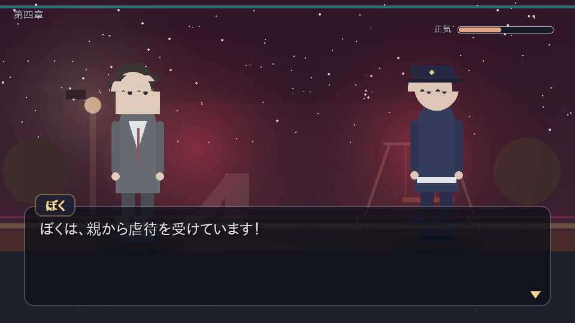
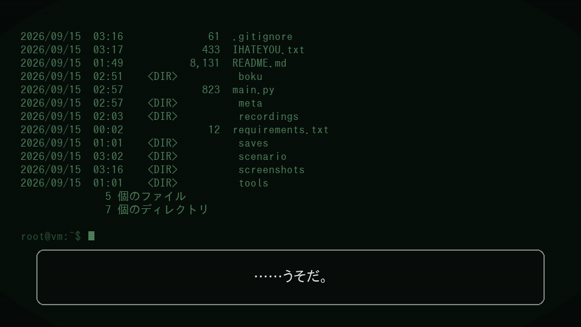
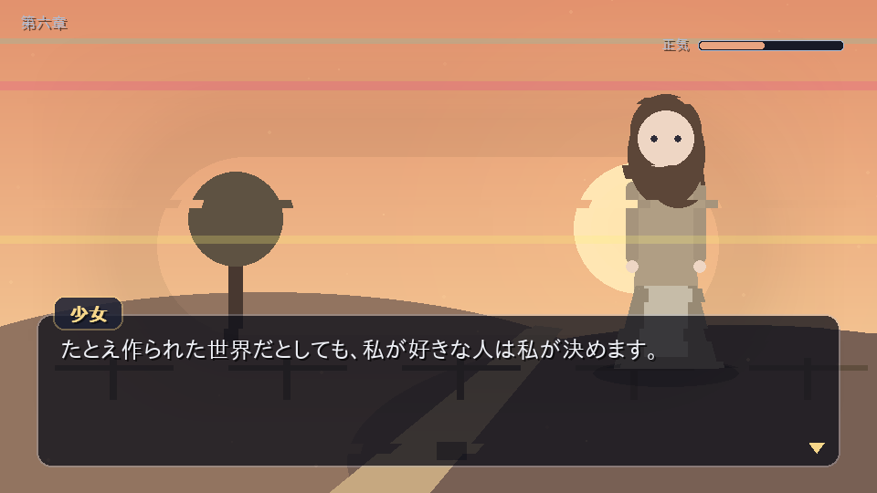
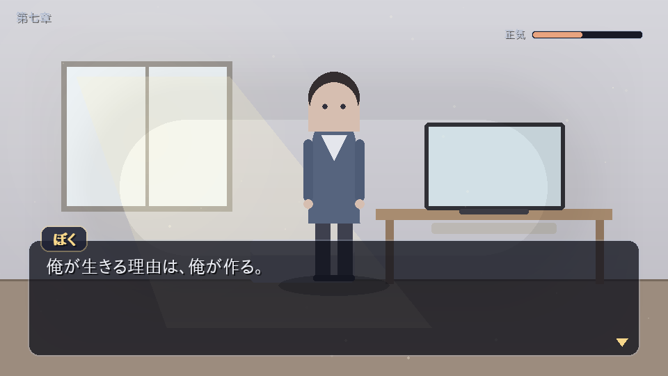

# ぼくだけのせかい

> テーマ：**自分の生きる理由は自分で決める**

Python + pygame で作った、ストーリー重視の RPG（ADV 寄り）です。全七章。
画像・音声の外部素材は一切使わず、背景も立ち絵も演出もすべてコードで描いています。


---

## あらすじ

魔王を倒した勇者は、すべてを手に入れた。ヒロイン、名声、富、民の称賛。
ただ、冒険に出る前の記憶だけが、まるで「ちょっとした設定」のように曖昧だった。

ある日、少年は自分が守った町に **「ほころび」** があることに気づく。
噴水は同じしぶきを繰り返し、パン屋は同じ台詞を二度言い、自分の銅像の名前だけが読めない。

> 「やめろ」「そこまでだ」
> 「目を覚ますな！！」「気づくな！！」

追いかけた先で、彼は目を覚ます。四十二日間、学校に行っていない中学二年生の部屋で。
あの世界は、彼が現実で満たされなかったものを埋めるために書いた、自作のゲームだった。

そこから彼は、現実で壊れ、病院に運ばれ、そして病室で一つの疑いに行き着く。

> 「この世界は、何のために作られたんですか」
> 「……もしかして、何の意味もないんですか」

## 遊びかた

```bash
pip install -r requirements.txt
python3 main.py
```

Windows（PowerShell）の場合は、`&&` が使えないバージョンがあるので 1 行ずつ実行してください。
コマンドは `python3` ではなく `python`（または `py`）です。

```powershell
git clone -b claude/pensive-meitner-nc7790 https://github.com/yasuhiro-fukuta/portfolio.git
cd portfolio\bokudake-no-sekai
python -m pip install -r requirements.txt
python main.py
```

| 操作 | 内容 |
| --- | --- |
| `Z` / `Enter` / `Space` / クリック | 読みすすめる・決定 |
| `↑` `↓` / `W` `S` / マウス | 選択肢を選ぶ |
| `←` `→` | 外出・潜入シーンの移動 |
| `Ctrl`（押しっぱなし） | 文字の早送り |
| `B` / ホイール上 | バックログ（履歴） |
| `ESC` | メニュー（セーブ／ロード／タイトルへ） |
| `F5` / `F9` | クイックセーブ／クイックロード |
| `F11` / `F12` | フルスクリーン／スクリーンショット |

章の頭では自動セーブされます。通しで 50〜70 分ほどです。

## 章立てと、遊びの種類

| 章 | 舞台 | 遊び |
| --- | --- | --- |
| 第一章「まもった世界」 | 魔王を倒したあとの王都 | **ほころび探し**（探索）。最初の分岐（忘れる／追いつづける） |
| 第二章「目が覚める」 | 現実の部屋と、夜の住宅街 | **おつかい**。人目を避けて保健室とスーパーへ。**正気ゲージ** |
| 第三章「また、夢の中で」 | ふたたび夢のゲーム世界 | 理想の世界と、その裏側。舞踏会の奥の扉。終盤に**逃走** |
| 第四章「壊れる」 | 現実（家・学校・役場・公園） | 助けを探して歩く。どこへ行っても「親元へ帰れ」。**夜の公園の徘徊** |
| 第五章「観測者」 | 精神科病棟 | **夜の病棟への潜入 ×3**（パソコン／職員室／置いてきた紙）と、**端末シーン** |
| 第六章「私が決めます」 | 作り直された異世界と、村 | 村の少女との日々。ほころびの探索。世界の崩壊 |
| 第七章「俺が決める」 | 病室、そして片付いた部屋 | 退院までの一か月。最後の選択と、最後の台詞 |

### 正気ゲージ

第二章と第四〜五章、外を歩いているあいだ **「正気」** が削られます。

- 人に**見られている**あいだ、減りつづける
- 電柱や物陰の**かげ**に入るとやり過ごせる（移動は遅くなるが、少しだけ回復する）
- 第二章で **0 になるとエンディング 2**（奇声を上げ、父親が警察を呼ぶ）
- 第五章では、見つかっても病室に戻されるだけ。何度でもやり直せます


## エンディング

| ID | 名前 | 条件 |
| --- | --- | --- |
| `wasureru` | 幸せな勇者 | 第一章で「忘れる」を選ぶ |
| `hodou` | 白い音 | 第二章で正気が 0 になる |
| `mitasareta` | 満たされた世界 | 第三章、差し出された手を取る |
| `kimeru` | **俺が決める**（真） | 第七章まで進める |

## 第五章の端末シーンについて

主人公が病棟のパソコンで「世界の外側」を覗く場面では、**作り物の画面ではなく、
実際に動いている環境の値**が表示されます。

- ホスト名、ユーザー名、**このマシンのローカル IP アドレス**
- **このゲームがあるフォルダの実際のパスと、その中のファイル一覧**（`dir` の出力）
- ファイルを書き換えようとして失敗する、**本物のエラーメッセージ**

そして、この場面を最後まで見ると、ゲームフォルダに置き手紙が一枚残ります。

**守っている決めごと**

1. 触れるのは、このゲームのフォルダの中だけ（外は例外を出して拒否）
2. 消すのは、このゲーム自身が作ったファイルだけ（`meta/manifest.json` で管理）
3. 既にあるファイルは書き換えない
4. 読み取った情報は、どこにも送信しない（画面に出すだけ）
5. 初回起動時に、必ず一度だけ断りの画面を出す

作られたファイルは、いつでも次のコマンドで消せます。

```bash
python3 main.py --cleanup
```

## 画面

| 王都の「ほころび」探し | ほころびが叫ぶ |
| --- | --- |
|  |  |

| 夜の公園（第四章） | 端末シーン（第五章） |
| --- | --- |
|  |  |

| 村はずれ（第六章） | 片付いた部屋（第七章） |
| --- | --- |
|  |  |

## 構成

```
bokudake-no-sekai/
├── main.py                起動スクリプト（--cleanup で作成物を削除）
├── boku/
│   ├── app.py             ウィンドウ・メインループ・シーンスタック
│   ├── script.py          シナリオ記法のパーサ（下記）
│   ├── art.py             背景・立ち絵・グリッチ描画（すべて図形）
│   ├── ui.py              文字組み・メッセージ枠・選択肢・履歴・演出
│   ├── meta.py            ゲームの外側に触れる窓口（安全装置つき）
│   ├── state.py           フラグと進行状態      save.py セーブ／ロード
│   ├── data/rooms.py      探索シーンのデータ
│   └── scenes/            notice / title / story / explore / route / console / ending
├── scenario/              物語本体（.txt）。ここだけ書き換えれば話を差し替えられる
└── tools/
    ├── check_scenario.py  シナリオの静的チェック
    ├── autoplay.py        ヘッドレス自動プレイ（全エンディング到達確認）
    ├── record.py          通しプレイの録画（章ごとに mp4 ＋ テキストログ）
    └── screenshots.py     主要画面の書き出し
```

### シナリオ記法

物語は Python ではなく `scenario/*.txt` に書きます。ファイル名の順に連結されます。

```
@bg capital_day             背景
@chapter 第一章|まもった世界   章タイトル演出（ここで自動セーブ）
@chara riina right          立ち絵
リィナ：やっぱり私の選んだ人は違うなあ。
石畳が、データの粒になって散る。            （名前なしは地の文）
@glitch 1.6                 その場面の不安定さ（0〜5／ときどき短く走る）
@burst 4.0                  その瞬間だけ強く走らせる
@choice
- 町を調べてみる -> ch1_search
- 進む -> c3_corridor_walk                 選択肢がひとつだけ、という演出もできる
@flag shouki - 12           フラグ操作（正気を削る）
@if errand_done >= 2 -> c2_go_home
@explore supermarket        探索パート     @route ward_pc   外出・潜入パート
@console ward_pc            端末シーン     @ending kimeru   エンディング
@shake 18   @flash white
```

### ほころびの見せかた

画面を揺らし続けると見ていて疲れるので、**ふだんは何も起きない**ようにしてあります。

- `@glitch N` … その場面の不安定さ。`N` が大きいほど発作の間隔が短いが、
  走るのは 1 回 0.1〜0.4 秒だけ（`N=1.6` で時間の約 4%、最大の `N=4` でも約 12%）
- `@burst N` … 扉が変わる、悲鳴、リィナが壊れる——そういう瞬間だけ強く走らせる
- 常時かかっているのは、暗い廊下・逃走・停電後のリビングなど、限られた場面のみ

### 動作確認

```bash
python3 tools/check_scenario.py   # ラベル・背景・立ち絵・部屋IDの参照が壊れていないか
python3 tools/autoplay.py --all   # 全エンディングに到達できるか（ヘッドレス）
python3 tools/record.py --all     # 通しプレイを章ごとに mp4 で録画
```

## 動作環境

Python 3.10 以上 / pygame 2.1 以上。日本語フォントは環境から自動で探します
（IPAGothic、Noto Sans CJK、メイリオ、ヒラギノなど）。
見つからない場合は環境変数 `BOKU_FONT` にフォントファイルのパスを指定してください。

## 内容について

いじめ、家庭内の暴言、自傷的な言動、刃物を持ち出す場面、精神科への医療保護入院、
性的な誘いを断る／受ける選択などを含みます。
