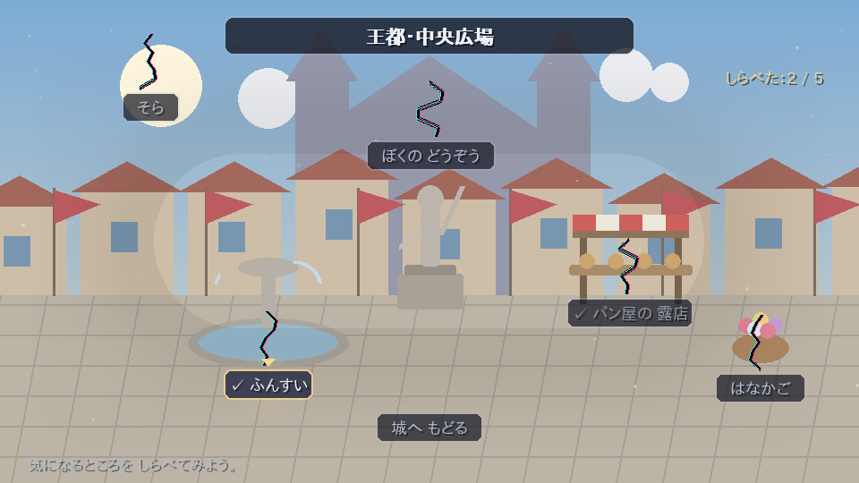
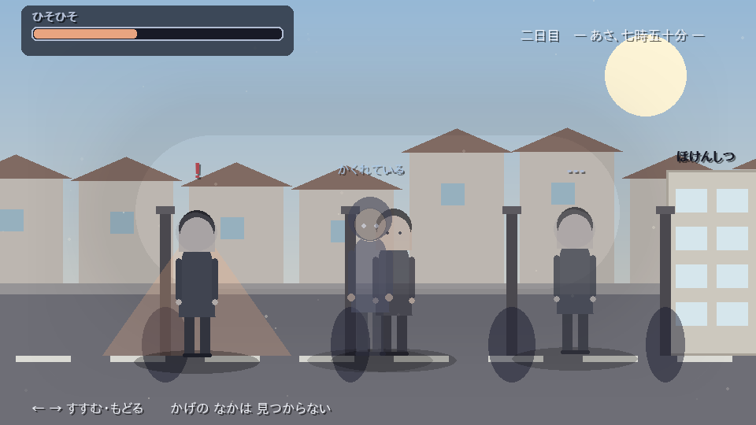
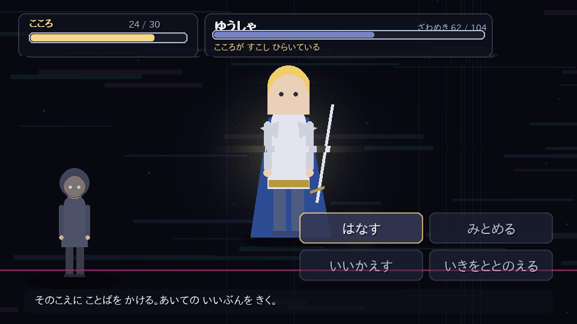

# ぼくだけのせかい

> テーマ：**自分の生きる理由は自分で決める**

Python + pygame で作った、ストーリー重視の RPG（ADV 寄り）です。
画像・音声の外部素材は一切使わず、背景も立ち絵も演出もすべてコードで描いています。


---

## あらすじ

魔王を倒した勇者は、すべてを手に入れた。ヒロイン、名声、富、民の称賛。
ただ、冒険に出る前の記憶だけが、まるで「ちょっとした設定」のように曖昧だった。

ある日、少年は自分が守った町に **「ほころび」** があることに気づく。
噴水は同じしぶきを繰り返し、パン屋は同じ台詞を二度言い、自分の銅像の名前だけが読めない。
周りの誰も、それを気にしていない。

ほころびを集めはじめた少年の前に、ノイズのような何かが現れて、こう言い残して消える。

> 「やめろ」「そこまでだ」

——この世界は、いったい誰のものなのか。

## 遊びかた

```bash
pip install -r requirements.txt
python3 main.py
```

| 操作 | 内容 |
| --- | --- |
| `Z` / `Enter` / `Space` / クリック | 読みすすめる・決定 |
| `↑` `↓` / `W` `S` / マウス | 選択肢を選ぶ |
| `←` `→` | 通学路シーンの移動 |
| `Ctrl`（押しっぱなし） | 文字の早送り |
| `B` / ホイール上 | バックログ（履歴） |
| `ESC` | メニュー（セーブ／ロード／タイトルへ） |
| `F5` / `F9` | クイックセーブ／クイックロード |
| `F11` / `F12` | フルスクリーン／スクリーンショット |

章の頭では自動セーブされます。プレイ時間の目安は 30〜40 分です。

## 章立て

| 章 | 舞台 | 遊びかた |
| --- | --- | --- |
| 第一章「まもったせかい」 | 魔王を倒したあとの王都 | 町の「ほころび」を探す探索パート。ここで最初の分岐（**忘れる／追いつづける**） |
| 第二章「めがさめる」 | 現実の部屋 | 少年が何者なのかが明かされる。部屋の探索 |
| 第三章「ほけんしつと、ぼくのせかい」 | 通学路・保健室・ゲームの中 | 人目を避けて保健室まで歩くミニゲーム × 3 日。夜はゲームの世界へ |
| 終章「じぶんできめる」 | 壊れたゲームの中 | 自分が作った「理想の勇者」との対話バトル。最後の選択 |

## エンディング

| ID | 名前 | 条件 |
| --- | --- | --- |
| `wasureru` | しあわせなゆうしゃ | 第一章で「わすれる」を選ぶ |
| `yuusha` | えいゆうのまま | 終章で理想の自分の手を取る |
| `futsuu` | ふつうのぼく | 終章でゲームをすべて消す |
| `jibun` | **ぼくがきめる**（真） | `じぶん` が 5 以上あるときだけ現れる選択肢を選ぶ |

「じぶん」は、自分で決めた選択・受けとめた言葉・引き返さなかった朝の数だけ増えます。
**生きる理由を自分で決める選択肢は、自分で決めてきた人にしか出てこない** ——という作りです。

## 画面

| 探索（ほころび探し） | ほころび |
| --- | --- |
|  |  |

| 通学路（人目を避ける） | 対話バトル |
| --- | --- |
|  |  |

## バトルについて

敵は「モンスター」ではなく、**声**と**理想の自分**です。HP ではなく「ざわめき」を静めます。

| コマンド | 効果 |
| --- | --- |
| はなす | 相手の言い分を聞く。相手の心が少し開く |
| みとめる | 自分のことだと引き受ける。「はなす」の直後がいちばん効く |
| いいかえす | よく効くが、相手は硬くなる。勝っても `ゆうしゃ`（依存）が上がる |
| いきをととのえる | こころを回復し、次の一撃をやわらげる |

負けても物語は終わりません。二度倒れると、その場面は語りとして先に進みます。

## 構成

```
bokudake-no-sekai/
├── main.py                起動スクリプト
├── boku/
│   ├── app.py             ウィンドウ・メインループ・シーンスタック
│   ├── script.py          シナリオ記法のパーサ（下記）
│   ├── art.py             背景・立ち絵・グリッチ描画（すべて図形）
│   ├── ui.py              文字組み・メッセージ枠・選択肢・履歴・演出
│   ├── state.py           フラグと進行状態      save.py セーブ／ロード
│   ├── data/              enemies.py（敵）  rooms.py（探索）
│   └── scenes/            title / story / explore / route / battle / ending
├── scenario/              物語本体（.txt）。ここだけ書き換えれば話を差し替えられる
└── tools/
    ├── check_scenario.py  シナリオの静的チェック
    ├── autoplay.py        ヘッドレス自動プレイ（全エンディング到達確認）
    └── screenshots.py     主要画面の書き出し
```

### シナリオ記法

物語は Python ではなく `scenario/*.txt` に書きます。ファイル名の順に連結されます。

```
@bg capital_day             背景
@chapter 第一章|まもったせかい  章タイトル演出（ここで自動セーブ）
@chara riina right          立ち絵
リィナ：やっぱり わたしの えらんだ ひとは ちがうなあ。
石だたみが、データの つぶに なって ちる。     （名前なしは地の文）
@glitch 2.6                 画面のほころび具合
@choice
- 町を しらべてみる -> ch1_search
- じぶんで きめる -> fin_jibun  [jibun>=5]     条件つき選択肢
@flag jibun + 1             フラグ操作
@if route_ok == 0 -> c3_day1_caught
@explore capital_square     探索パート    @route 2  通学路パート
@battle yuusha              バトル        @ending jibun  エンディング
```

### 動作確認

```bash
python3 tools/check_scenario.py   # ラベル・背景・立ち絵・敵IDの参照が壊れていないか
python3 tools/autoplay.py --all   # 4 つのエンディングすべてに到達できるか
```

```
✓ 第一章で わすれる            → 到達: wasureru
✓ ゆうしゃに よりかかる          → 到達: yuusha
✓ ぜんぶ けして ふつうに         → 到達: futsuu
✓ じぶんで きめる（真）          → 到達: jibun
✓ 見つかりながら すすむ          → 到達: jibun
```

## 動作環境

Python 3.10 以上 / pygame 2.1 以上。日本語フォントは環境から自動で探します
（IPAGothic、Noto Sans CJK、メイリオ、ヒラギノなど）。
見つからない場合は環境変数 `BOKU_FONT` にフォントファイルのパスを指定してください。
